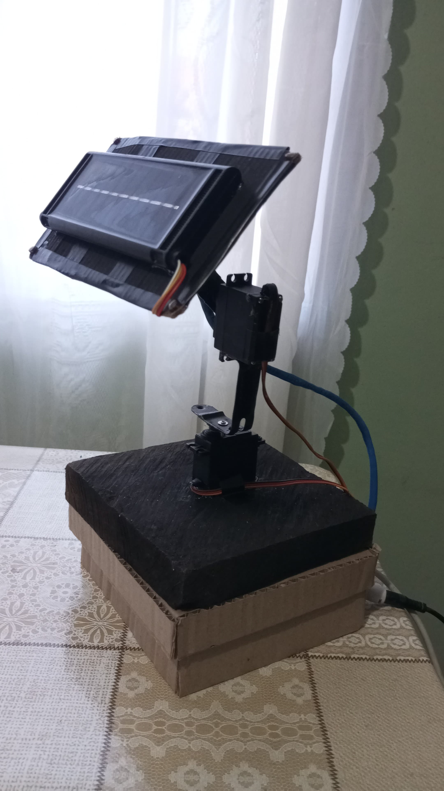
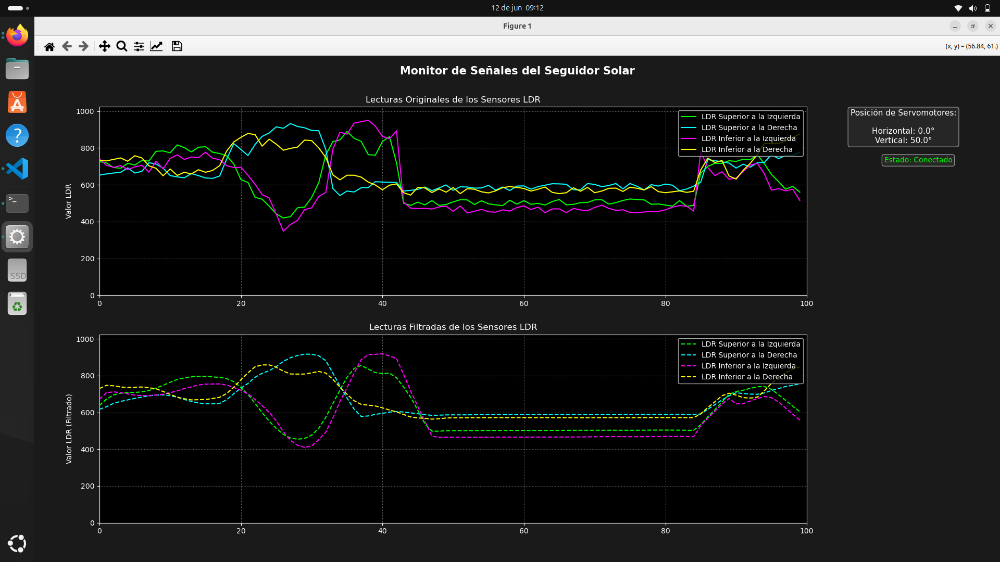

# ProyectoFinal
# 🌞 Proyecto de Seguimiento Solar con Arduino y Python

Este proyecto implementa un **sistema de seguimiento solar automático** mediante una plataforma de doble eje, que permite a un panel solar seguir la dirección de la mayor intensidad de luz durante el día.

Se utiliza un **Arduino UNO** para el control físico (sensado y movimiento) y un programa en **Python** para recibir datos en tiempo real a través del puerto serial, visualizarlos y registrarlos si se desea.

---

## ⚙️ ¿Cómo Funciona?

El sistema emplea **4 sensores LDR (Light Dependent Resistor)** distribuidos en una cruceta, que permiten detectar dónde hay más luz. Con base en esa información:

- Se mueven **2 servomotores**: uno para el eje horizontal (azimut) y otro para el eje vertical (elevación).
- El Arduino calcula las diferencias de intensidad lumínica para orientar el panel.
- Python lee los datos por **comunicación serial** y los representa gráficamente usando `matplotlib`.

---

## 🧰 Tecnologías Usadas

- **Arduino UNO/Nano**
- **Python 3.11**
- **matplotlib** para gráficos en tiempo real
- **pyserial** para la lectura de datos seriales
- **Librería `time` y `serial`**
- **4 LDRs + 4 resistencias** (divisores de voltaje)
- **2 Servomotores SG90**
- **Protoboard, cables, y base de cartón/madera para soporte del panel**

---

## 📚 Librerías Utilizadas en Python

- **Comunicación con el puerto serial** : Arduino u otro microcontrolador.
- **matplotlib.pyplot** : Crear y actualizar gráficas.
- **matplotlib.animation.FuncAnimation** : Animación en tiempo real de las gráficas.
- **collections.deque** : Estructura eficiente para manejar datos que se actualizan constantemente.
- **platform**: Detectar el sistema operativo y ajustar el puerto serial.
- **random** : Generar ruido en los datos para simular variabilidad.
- **numpy**

---

## 🖼️ Imagen Referencial

---

